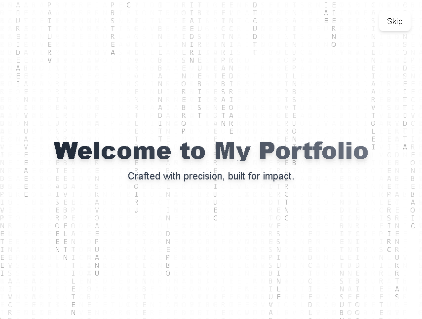

# Designing a Matrix-Inspired Splash Screen for My Portfolio

In my journey of building a next-gen developer portfolio, I wanted the landing experience to be more than just a static page; I wanted it to *feel* like something immersive. That’s how the idea for a **Matrix-inspired splash screen** came to life.

---

## What It Looks Like

Here is a quick glimpse of the custom landing experience integrated :

*Matrix-style splash screen with glowing vertical code and a clean minimalist overlay*

---

## The Vision

The challenge was balancing **the digital mystique of the Matrix** — with its streaming glyphs and cyber-vibes — with a **sleek, modern interface**. I didn’t want to overwhelm visitors or lean into nostalgia too heavily. Instead, I focused on merging the essence of that iconic aesthetic with a minimal, contemporary layout.

- **Matrix-style animation** reimagined for a white background
- **Polished typography and layout** to support professionalism
- **Crisp visual transitions** to hint at interactivity, not noise

- **Flowing visual energy** that is subtly alive like digital rain  
- A futuristic feel that says, *"you’re about to enter something different."*

---

## Why the Matrix?

The Matrix has always symbolized depth, duality, and the unseen layers beneath digital systems; a metaphor that aligns perfectly with my work in tech. Incorporating that energy into my site’s introduction felt authentic, especially as someone building tools behind the screen.

---

## The Experience

When visitors land on my portfolio, they're greeted with:

- A bold **intro message** at the center
- A smooth, flowing **particle animation** evoking digital signals or neural nodes
- A **Skip** button for quick access, but with graceful fade transitions

It’s designed to be short, elegant, and impactful; giving that cinematic “opening credits” feel before diving into the content.

---

## My Design Goals

1. **Immersion**  
   It had to feel alive, not just look good.

2. **Performance**  
   Light enough to load fast, smooth enough not to stutter.

3. **Clean Canvas**  
   A white background breaks tradition with the Matrix’s dark tones — creating contrast and making the animation feel fresh and unexpected.

4. **Modern Stack**  
   Built with Next.js and Tailwind CSS to ensure modern dev practices and scalability.

5. **Intentional Interactivity**  
   A ‘Skip’ button puts control in the user’s hands, fading the screen out smoothly and transitioning into the main experience.

---

## Why a Splash Screen?

In a world of instant content, taking 5 seconds to *set the tone* changes everything. It's not just a portfolio; it's an experience. The splash screen lets visitors reset and prepare for a crafted, personal digital journey.

---

## What’s Next

The current splash screen is intentionally lightweight; optimized for performance and mobile-first responsiveness I’m planning:

- Themed background audio
- Advanced particle interactions
- Subtle animations that evolve as the site loads

---

## Final Thoughts

This splash screen is more than a stylistic flourish; it’s a **brand signature**, reflecting how I blend creativity with structure, and pay tribute to the past while building the future. This was is my way of saying: I care about the details, and I build with intention.

Let’s create more moments like this.